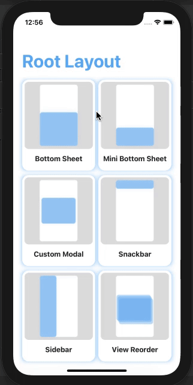

# RootLayout Demo

> 🤹 Demo for Nativescript 8's RootLayout Component



## Development

This app is built with the NativeScript CLI. Once you have the [CLI installed](https://docs.nativescript.org/start/quick-setup), start by cloning the repo:

```bash
git clone https://github.com/williamjuan027/nativescript-rootlayout-demo.git

cd nativescript-rootlayout-demo/demo-ng
```

Install the project's dependencies

```bash
npm install
```

You can then run the app on iOS and Android using the following commands:

```bash
ns run ios

ns run android
```

> This app uses the new RootLayout component from Nativescript 8, make sure that the NativeScript 8 is installed prior to running the app

```bash
npm install -g nativescript
```

## How to Use RootLayout

`RootLayout` is meant to be used as the outermost container for your app. In Angular, this refers to the layout in your `app.component.html` which contains your `page-router-outlet` and other UI elements.

```html
<!-- app.component.html -->
<RootLayout>
  <page-router-outlet></page-router-outlet>
</RootLayout>
```

_`RootLayout` related functionalities are handled in [`ui.service.ts`](https://github.com/williamjuan027/nativescript-rootlayout-demo/blob/master/demo-ng/src/app/core/services/ui.service.ts)_

### RootLayout Methods

`getRootLayout()` returns the RootLayout instance which has the following methods:

| Method                          | Description                                                                                                                    |
| ------------------------------- | ------------------------------------------------------------------------------------------------------------------------------ |
| open(view: View, options?: RootLayoutOptions): Promise<void> | Opens the target view |
| close(view: View, exitTo?: TransitionAnimation): Promise<void> | Closes the target view |
| bringToFront(view: View, animated?: boolean): Promise<void> | Moves the target view to the front (highest z-index) |
| getShadeCover(): View | Returns the shade cover instance |

